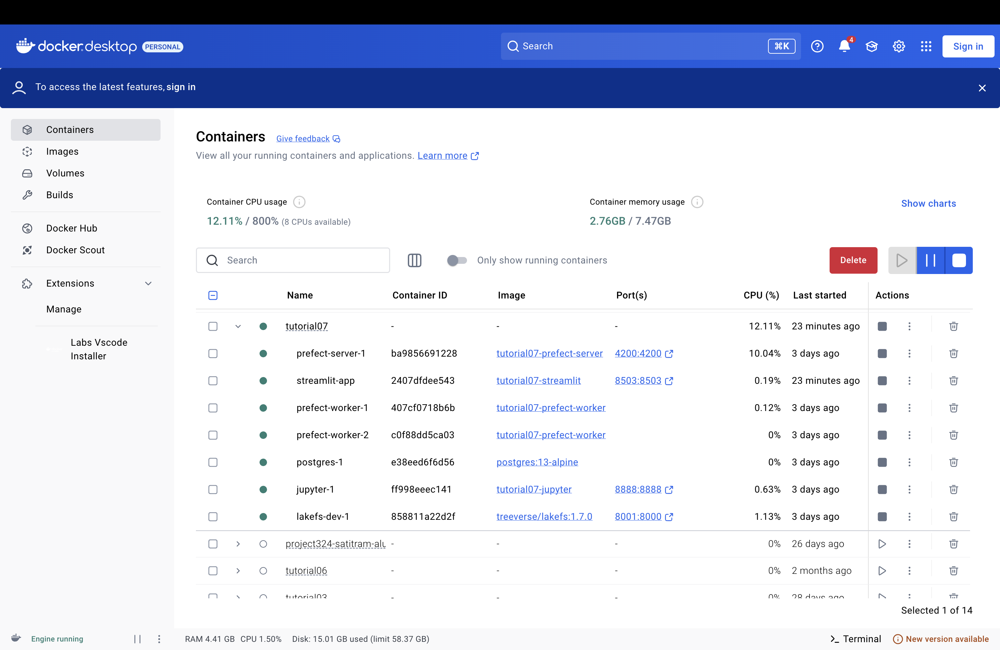
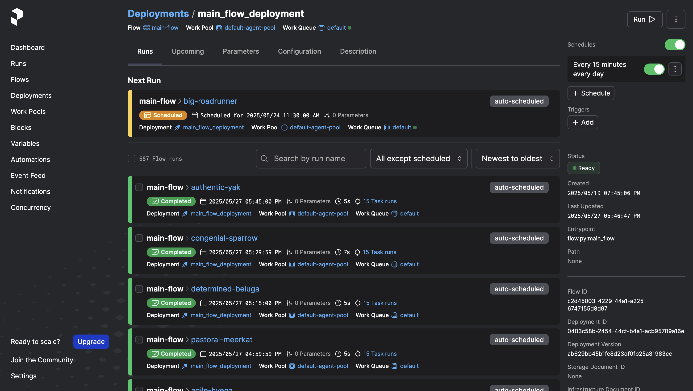
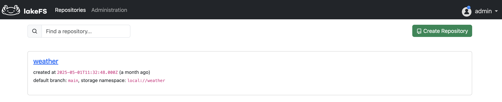
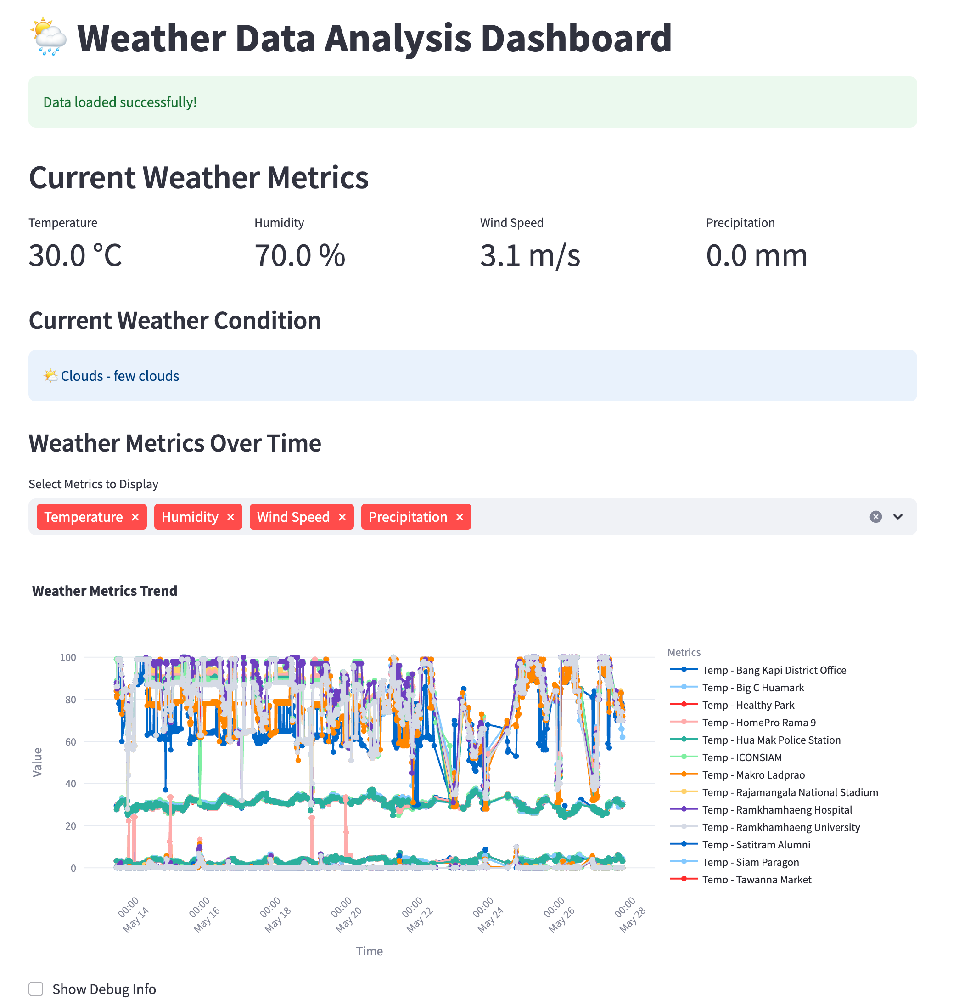
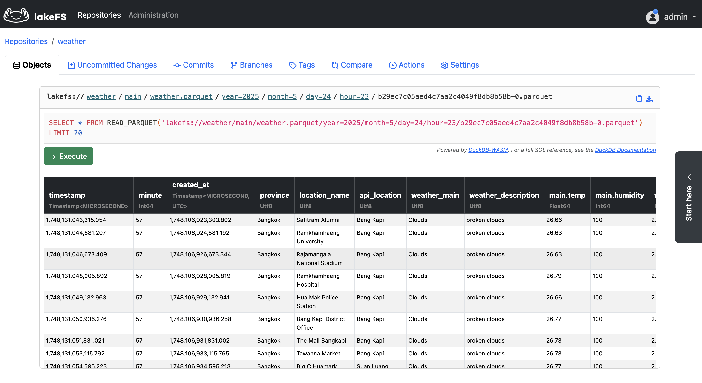
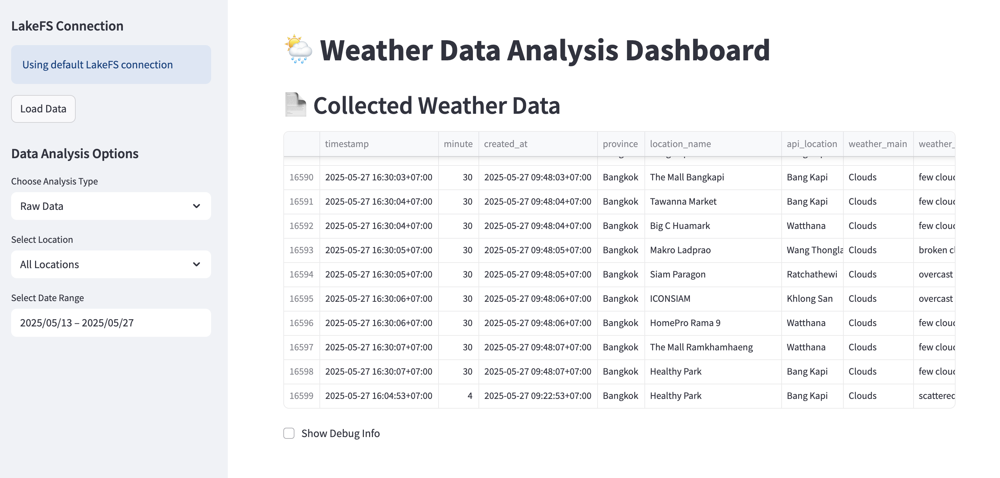
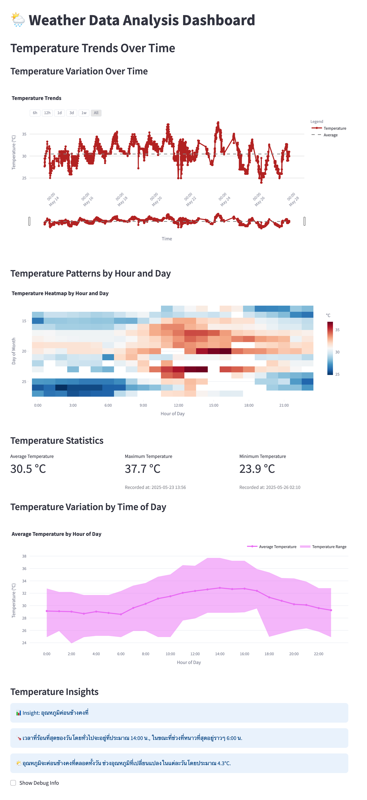
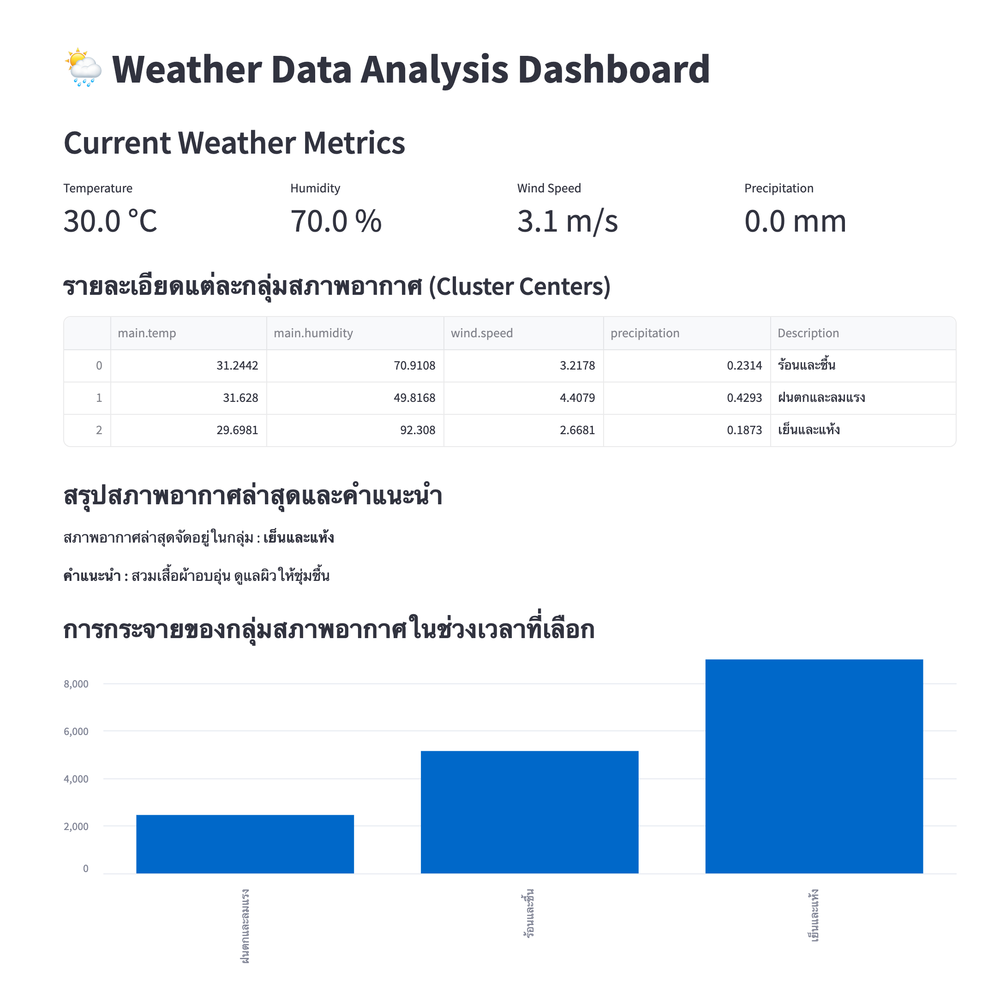

# ระบบเก็บและวิเคราะห์ข้อมูลสภาพอากาศแบบอัตโนมัติด้วย Prefect, LakeFS, และ Streamlit  
### รายวิชา DSI321: โครงสร้างพื้นฐานคอมพิวเตอร์สำหรับการประมวลผลข้อมูลขนาดใหญ่
### ชื่อโครงงาน :  Real-Time Weather Data Pipeline with Visualization

### 👨‍💻 จัดทำโดย
- วรานิษฐ์ เตชะระพีพัฒน์  
- 6524651392 
---

## 1. ความเป็นมา

ในยุคที่ข้อมูลเป็นศูนย์กลางของการตัดสินใจ การมีระบบที่สามารถรวบรวมและวิเคราะห์ข้อมูลแบบเรียลไทม์ได้อย่างแม่นยำมีความสำคัญอย่างยิ่ง โดยเฉพาะในบริบทของสภาพอากาศซึ่งมีผลกระทบต่อกิจกรรมประจำวันและสุขภาพของประชาชน โครงงานนี้จึงมีเป้าหมายในการพัฒนาระบบ Data Pipeline สำหรับการเก็บข้อมูลสภาพอากาศจากพื้นที่ของสมาคมศิษย์เก่าสาธิตรามคำแหงและพื้นที่ใกล้เคียง 15 แห่ง โดยใช้ Prefect 3 สำหรับการควบคุม workflow, Docker สำหรับสภาพแวดล้อม, และ LakeFS สำหรับจัดเก็บข้อมูลแบบ version control

ระบบนี้จะเก็บข้อมูลจาก OpenWeatherMap API ทุก 15 นาที แปลงข้อมูลให้อยู่ในรูปแบบ Parquet และเก็บใน Data Lake ผ่าน LakeFS ก่อนนำไปแสดงผลผ่าน Streamlit Dashboard ที่ใช้งานง่าย ทั้งนี้ยังมีการประยุกต์ใช้ Machine Learning อย่าง K-means เพื่อจำแนกกลุ่มสภาพอากาศและแสดงแนวโน้มผ่าน visualization ที่เข้าใจง่าย

---

## 2. วัตถุประสงค์ของโครงการ

โครงการนี้มีวัตถุประสงค์เพื่อสร้างระบบที่ครบวงจรในการจัดเก็บ วิเคราะห์ และแสดงข้อมูลสภาพอากาศ โดยเฉพาะเพื่อ

| วัตถุประสงค์                                    | รายละเอียด                                                                                         |
|--------------------------------------------------|--------------------------------------------------------------------------------------------------|
| พัฒนา Data Pipeline แบบอัตโนมัติ                | ใช้ Prefect 3 ควบคุมการดึงข้อมูลและ Workflow ให้เป็นระบบ และรันทุก 15 นาที                         |
| สร้างระบบจัดเก็บข้อมูลแบบ version control       | ใช้ LakeFS เพื่อให้สามารถจัดการเวอร์ชันข้อมูลและย้อนกลับได้เมื่อเกิดข้อผิดพลาด                      |
| พัฒนา Dashboard สำหรับการแสดงผลข้อมูลแบบ Interactive | ให้ผู้ใช้สามารถดูข้อมูลย้อนหลัง วิเคราะห์แนวโน้ม และกรองข้อมูลตามพื้นที่และเวลาได้อย่างสะดวก          |
| นำ Machine Learning มาวิเคราะห์และจำแนกลักษณะสภาพอากาศ | ใช้ K-Means clustering จำแนกกลุ่มสภาพอากาศ และช่วยเพิ่มบริบทเพื่อการตัดสินใจที่ดียิ่งขึ้น              |
| ส่งเสริมความรู้และทักษะด้าน Data Engineering และ Data Science | ฝึกใช้งาน Docker, Prefect, LakeFS, และ Streamlit ในโครงงานจริง                                 |

---

## 3. ประโยชน์ที่ได้รับ

| กลุ่มผู้ใช้งาน         | ประโยชน์ที่ได้รับ                                                                 |
|------------------------|----------------------------------------------------------------------------------|
| นักพัฒนา/นักวิจัย      | ได้ระบบที่สามารถเก็บข้อมูลและวิเคราะห์เชิงลึก พร้อมนำไปต่อยอดทางโมเดล ML ได้ |
| หน่วยงานท้องถิ่น       | สามารถใช้ข้อมูลเพื่อวางแผนกิจกรรมในพื้นที่ที่มีสภาพอากาศแปรปรวน             |
| นักเรียน/นักศึกษา      | เป็นแหล่งข้อมูลที่สามารถใช้ฝึกวิเคราะห์หรือศึกษาเกี่ยวกับ Data Pipeline       |

---


## 4. ตัวชี้วัดความสำเร็จของโครงงาน (Key Performance Indicators)

| หมวดหมู่    | KPI ที่ตั้งไว้                                                                                      |
|-------------|--------------------------------------------------------------------------------------------------|
| ด้านเทคนิค | - ระบบ Prefect ทำงานทุก 15 นาทีโดยไม่ล้มเหลวเกิน 1% ต่อวัน<br>- ข้อมูลถูกจัดเก็บใน LakeFS และสามารถย้อนดูเวอร์ชันได้ |
| ด้านการวิเคราะห์ | - ข้อมูลสามารถจำแนกกลุ่มได้อย่างน้อย 3 กลุ่มด้วย K-means<br>- Visualization เข้าใจง่ายและมีการตีความข้อมูลที่เป็นประโยชน์   |
| ด้านการใช้งาน | - Dashboard ใช้งานได้ราบรื่น ไม่มี bug ร้ายแรง<br>- รองรับผู้ใช้พร้อมกันได้อย่างน้อย 10 คน                                |
| ด้านการศึกษา | - นักศึกษาสามารถอธิบายเทคโนโลยีที่ใช้ได้ครบทุกตัว<br>- มีเอกสาร README และ Diagram อธิบายโครงสร้างระบบ                  |

---

## 5. ภาพรวมแผนดำเนินโครงการ

### ระยะเวลา: 3 สัปดาห์ (ประมาณ 10–15 ชั่วโมงต่อสัปดาห์)

#### 📅 สัปดาห์ที่ 1 (28 เมษายน – 4 พฤษภาคม)
- ออกแบบโครงสร้างระบบและฐานข้อมูล
- ออกแบบ Data Architecture และ Data Flow Diagram
- สร้าง GitHub repository สำหรับ version control
- ติดตั้งและตั้งค่า Docker environment
- ออกแบบ schema สำหรับเก็บข้อมูลในรูปแบบ Parquet

**Deliverables:**
- ผังโครงสร้างระบบ (Infrastructure Diagram)
- แผนผังฐานข้อมูล (Parquet Schema)
- ไฟล์ `docker-compose.yml` พร้อมใช้งาน

#### ตัวอย่างภาพประกอบ



#### คำอธิบาย
ภาพ Docker Container Diagram แสดง container หลักของระบบ ได้แก่ Prefect สำหรับจัดการ workflow, LakeFS สำหรับจัดเก็บข้อมูลแบบมีเวอร์ชัน, Streamlit สำหรับแสดงผล, Jupyter สำหรับวิเคราะห์ข้อมูล, และ PostgreSQL สำหรับ metadata ของ Prefect โดยทั้งหมดเชื่อมต่อกันผ่าน Docker Compose.

---

#### 📅 สัปดาห์ที่ 2 (5 พฤษภาคม – 11 พฤษภาคม)
- พัฒนา Prefect Flow สำหรับดึงข้อมูลสภาพอากาศจาก OpenWeatherMap API ทุก 15 นาที
- ประมวลผลและจัดเก็บข้อมูลลงใน Parquet ผ่าน LakeFS
- พัฒนาแดชบอร์ดด้วย Streamlit สำหรับแสดงข้อมูลสภาพอากาศแบบเรียลไทม์

**Deliverables:**
- Flow ที่ทำงานได้สมบูรณ์ใน Prefect
- ข้อมูลที่เก็บในรูปแบบ Parquet และ versioned ใน LakeFS
- Dashboard ที่อัปเดตข้อมูลเรียลไทม์
- โค้ดอัปโหลดและจัดการบน GitHub อย่างต่อเนื่อง

#### ตัวอย่างภาพประกอบ




#### คำอธิบาย
- ภาพ Prefect Flow UI แสดง Workflow ที่จัดการการดึงข้อมูลและการประมวลผลข้อมูลทุก 15 นาที
- ภาพ Repository ชื่อ weather ในระบบ LakeFS ซึ่งใช้สำหรับจัดเก็บไฟล์ข้อมูลสภาพอากาศแบบ Parquet โดยมีระบบ version control รองรับการจัดการข้อมูลย้อนหลังและการเปรียบเทียบเวอร์ชัน

---

#### 📅 สัปดาห์ที่ 3 (12 พฤษภาคม – 18 พฤษภาคม)
- ทดสอบระบบและตรวจสอบเสถียรภาพของ Dashboard
- เพิ่มฟีเจอร์เชิงโต้ตอบในแดชบอร์ด เช่น กราฟย้อนหลัง, ฟิลเตอร์ข้อมูล, และข้อมูลจำแนกกลุ่ม
- จัดทำรายงาน README พร้อมคำอธิบายและ Infographic

**Deliverables:**
- ระบบ pipeline ที่ deploy แล้วและทำงานได้จริง
- Dashboard ที่ผ่านการทดสอบและมีความเสถียร
- README, รายงาน, และเอกสาร Infographic พร้อมใช้งาน

#### ตัวอย่างภาพประกอบ



#### คำอธิบาย
แดชบอร์ด Streamlit แสดงข้อมูลสภาพอากาศล่าสุดพร้อมกราฟแนวโน้มย้อนหลัง และฟิลเตอร์สำหรับเลือกดูข้อมูลตามพื้นที่และช่วงเวลา

---

### 🛠 เครื่องมือและทรัพยากรที่ใช้ (Resources & Tools)

| เครื่องมือ | หน้าที่ |
|------------|---------|
| **Prefect 3** | จัดการ workflow และ scheduling |
| **Docker / Docker Compose** | สร้างสภาพแวดล้อมการทำงานที่เหมือนกันทุกเครื่อง |
| **LakeFS** | จัดเก็บข้อมูลแบบ version control |
| **OpenWeatherMap API** | ดึงข้อมูลสภาพอากาศ |
| **Python** | ภาษาหลักในการพัฒนา |
| **Streamlit** | พัฒนา dashboard แบบ interactive |
| **Parquet** | รูปแบบการจัดเก็บข้อมูลที่มีโครงสร้างและประหยัดพื้นที่ |
| **GitHub** | Version control และเผยแพร่โค้ดโปรเจกต์ |

---

### 🧰 เทคโนโลยีที่ใช้เพิ่มเติม

- **Jupyter Notebook**: สำหรับการวิเคราะห์ข้อมูลเบื้องต้น และทดสอบโมเดล
- **Shell Script**: สำหรับสั่งรัน Prefect Flow และ Automate Task ต่าง ๆ
- **K-means Clustering**: สำหรับจำแนกกลุ่มสภาพอากาศ (Clustering)
- **Matplotlib / Plotly**: สำหรับการสร้างกราฟเชิงวิเคราะห์

---

### 🚀 วิธีเริ่มต้นใช้งาน (Getting Started)

1. ติดตั้ง Docker และ Docker Compose บนเครื่องของคุณ  
2. โคลนโปรเจกต์นี้:

```bash
git clone https://github.com/Waranit-tec/dsi321_2025.git
```
3.	เข้าไปในโฟลเดอร์โปรเจกต์:

```bash
cd dsi321_2025/tutorial07
```
4.	รันระบบด้วย Docker Compose:

```bash
docker-compose up
```
5.	ติดตั้ง dependencies:

```bash
pip install -r requirements.txt
```
6.	รันแอปพลิเคชัน Streamlit:

```bash
streamlit run app.py
```

---

## 6. บทสรุป

โครงการนี้ได้พัฒนาระบบเก็บข้อมูลสภาพอากาศแบบเรียลไทม์สำหรับพื้นที่สมาคมศิษย์เก่าสาธิตและพื้นที่ใกล้เคียงครบ 15 แห่ง โดยสามารถดึงข้อมูลได้อย่างต่อเนื่องและจัดเก็บข้อมูลในรูปแบบไฟล์ Parquet ผ่าน LakeFS ได้อย่างมีประสิทธิภาพ รวมทั้งนำข้อมูลมาวิเคราะห์ด้วยเทคนิค K-means clustering เพื่อแบ่งกลุ่มสภาพอากาศที่มีลักษณะใกล้เคียงกัน และแสดงผลข้อมูลผ่านแดชบอร์ด Streamlit ที่ใช้งานง่าย
ระบบนี้จะเป็นประโยชน์ต่อการวางแผนจัดการสภาพอากาศ การวิจัย และการให้ข้อมูลที่ทันสมัยแก่ผู้ใช้งานในชุมชน ซึ่งเป็นรากฐานสำคัญสำหรับการพัฒนาระบบพยากรณ์และบริหารจัดการในอนาคต

### ผลลัพธ์

#### 🧬 ระบบจัดเก็บแบบ version control ด้วย LakeFS

#### คำอธิบาย
ภาพนี้แสดงตัวอย่างชุดข้อมูลสภาพอากาศที่ถูกดึงมาจาก OpenWeatherMap API และจัดเก็บในระบบ LakeFS โดยอยู่ในรูปแบบไฟล์ Parquet ซึ่งประกอบด้วยคอลัมน์สำคัญ เช่น timestamp, created_at, province, location_name, weather_main, main.temp, wind.speed, และ precipitation เป็นต้น โดยข้อมูลนี้ถูกจัดเก็บพร้อมบริบทด้านเวลา เช่น วัน เดือน ปี และชั่วโมง เพื่อใช้ในการวิเคราะห์แนวโน้มและจำแนกกลุ่มสภาพอากาศในภายหลัง

#### 📁 Raw data ทั้งหมด ที่ดึงข้อมูลจาก LakeFS แสดงผลบน Streamlit

#### คำอธิบาย
ภาพนี้แสดงข้อมูลดิบ (Raw Data) ทั้งหมดที่ถูกดึงมาจาก LakeFS และนำมาแสดงผลบน Streamlit Dashboard โดยข้อมูลเหล่านี้เป็นผลจากการเก็บข้อมูลสภาพอากาศแบบอัตโนมัติทุก 15 นาทีจาก 15 พื้นที่ ขณะนี้มีจำนวนรวมทั้งสิ้น 16,599 แถว ครอบคลุมข้อมูลทั้งด้านอุณหภูมิ ความชื้น ลม ปริมาณน้ำฝน และรายละเอียดสภาพอากาศอื่น ๆ พร้อมบริบทด้านเวลาและสถานที่ เพื่อใช้ในการวิเคราะห์และแสดงผลในรูปแบบ Interactive


#### 📊 Dashboard ที่พัฒนาโดย Streamlit

#### คำอธิบาย
ภาพนี้แสดงหน้าจอ Dashboard บน Streamlit ซึ่งประกอบด้วย 4 ส่วนหลัก ได้แก่ (1) Current Weather Metrics แสดงค่าพยากาศล่าสุดตามวันที่และพิกัดที่ผู้ใช้เลือก หรือทั้งหมด (2) Current Weather Condition แสดงคำอธิบายสภาพอากาศปัจจุบันในรูปแบบข้อความ (3) Weather Metrics Over Time แสดงกราฟการเปลี่ยนแปลงของค่าต่าง ๆ เช่น อุณหภูมิ ความชื้น และความเร็วลม ตามช่วงเวลาที่เลือก และ (4) Weather Metric Trend แสดงแนวโน้มของข้อมูลในภาพรวม เช่น ค่าเฉลี่ยอุณหภูมิรายวัน โดยผู้ใช้สามารถเลือกดูข้อมูลเฉพาะพิกัด วัน หรือดูภาพรวมทั้งหมดได้ตามต้องการ


#### คำอธิบาย
ภาพนี้แสดงส่วนวิเคราะห์ข้อมูลอุณหภูมิใน Streamlit Dashboard โดยประกอบด้วย (1) Temperature Variation Over Time แสดงกราฟการเปลี่ยนแปลงของอุณหภูมิรายวันตามช่วงเวลาที่เลือก (2) Temperature Patterns by Hour and Day แสดงรูปแบบอุณหภูมิตามชั่วโมงและวันในรูปแบบ Heatmap เพื่อดูแนวโน้มความร้อนเย็นในแต่ละช่วงเวลา (3) Temperature Statistics แสดงค่าสถิติพื้นฐาน เช่น ค่าเฉลี่ย ค่าสูงสุด ค่าต่ำสุด และส่วนเบี่ยงเบนมาตรฐานของอุณหภูมิ (4) Temperature Variation by Time of Day แสดงการเปลี่ยนแปลงของอุณหภูมิตามช่วงเวลาของวัน เช่น เช้า บ่าย เย็น และกลางคืน และ (5) Temperature Insights สรุปข้อสังเกตหรือแนวโน้มที่น่าสนใจจากข้อมูล เช่น ช่วงเวลาที่ร้อนที่สุดในรอบวัน หรือวันใดที่อุณหภูมิผันผวนมากที่สุด เพื่อสนับสนุนการตัดสินใจหรือวางแผนกิจกรรมตามสภาพอากาศ

#### 🧠 การจำแนกกลุ่มสภาพอากาศด้วย K-means

#### คำอธิบาย
ภาพด้านบนแสดงผลการวิเคราะห์ข้อมูลสภาพอากาศด้วยเทคนิค **K-Means Clustering** โดยแบ่งออกเป็น 3 กลุ่ม ตามตัวแปรหลัก ได้แก่ อุณหภูมิ ความชื้น ความเร็วลม และปริมาณฝน โดยประกอบด้วย:

- **Current Weather Metrics**: แสดงค่าปัจจุบันของอุณหภูมิ ความชื้น ความเร็วลม และฝน
- **ตาราง Cluster Centers**: สรุปค่าเฉลี่ยของแต่ละกลุ่ม พร้อมคำอธิบายลักษณะเด่น:
  - กลุ่มที่ 0: ร้อนและชื้น  
  - กลุ่มที่ 1: ฝนตกและลมแรง  
  - กลุ่มที่ 2: เย็นและแห้ง
- **กราฟการกระจายของกลุ่มสภาพอากาศ**: แสดงจำนวนข้อมูลของแต่ละกลุ่มในช่วงเวลาที่เลือก เพื่อดูแนวโน้มของสภาพอากาศที่เกิดขึ้นบ่อย
- **คำแนะนำจากกลุ่มล่าสุด**: ระบบให้คำแนะนำตามกลุ่มที่ตรวจพบ เช่น หากเป็นกลุ่ม "เย็นและแห้ง" ระบบจะแนะนำให้ดูแลผิวให้ชุ่มชื้น
  
การแสดงผลนี้ช่วยให้ผู้ใช้สามารถเข้าใจรูปแบบของสภาพอากาศ และนำไปใช้ในการตัดสินใจหรือวางแผนกิจกรรมประจำวันได้อย่างเหมาะสม
---

